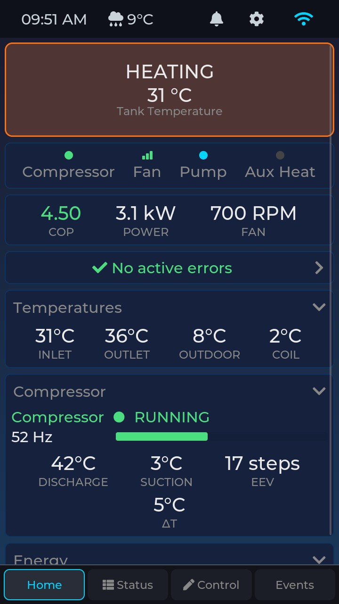
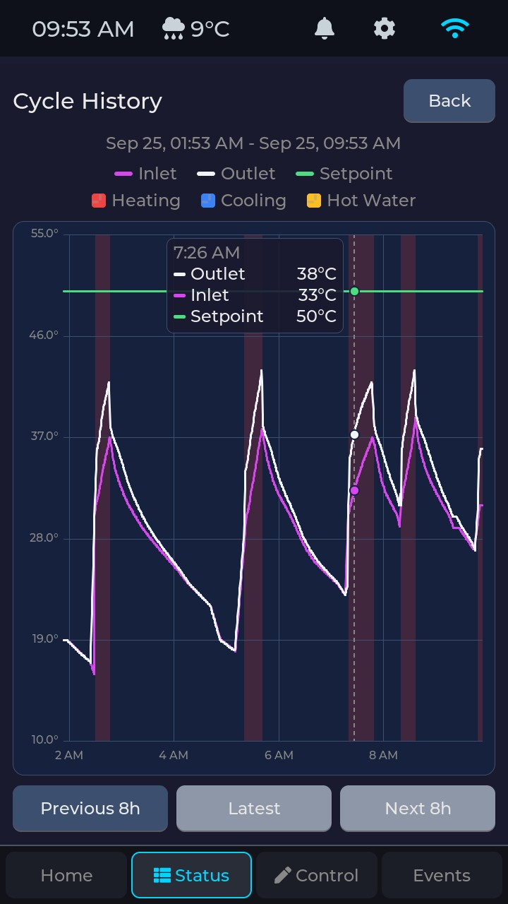
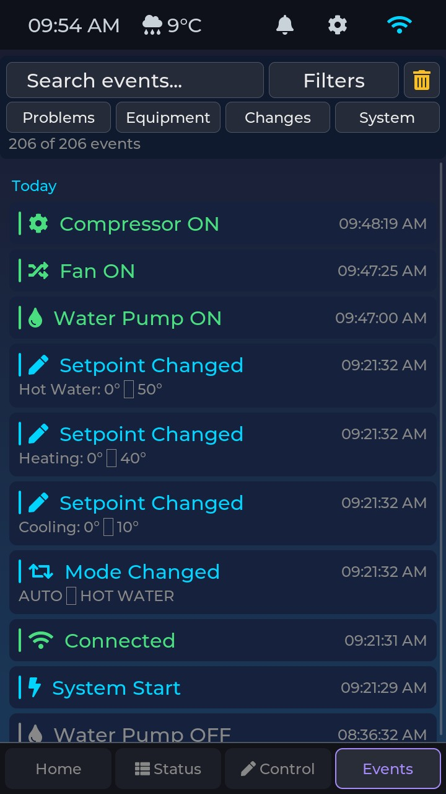
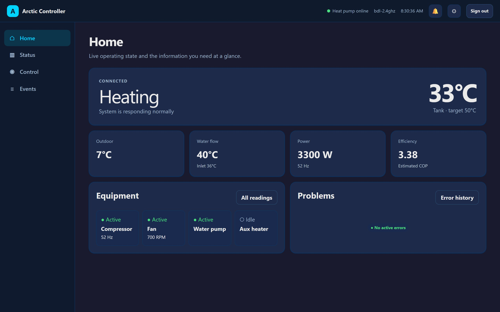
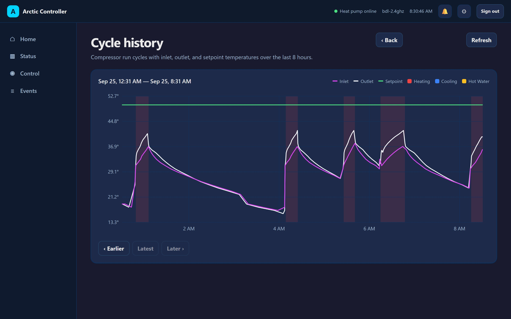
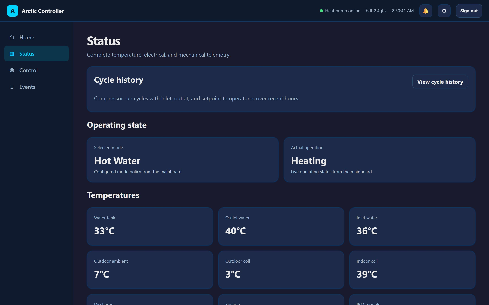
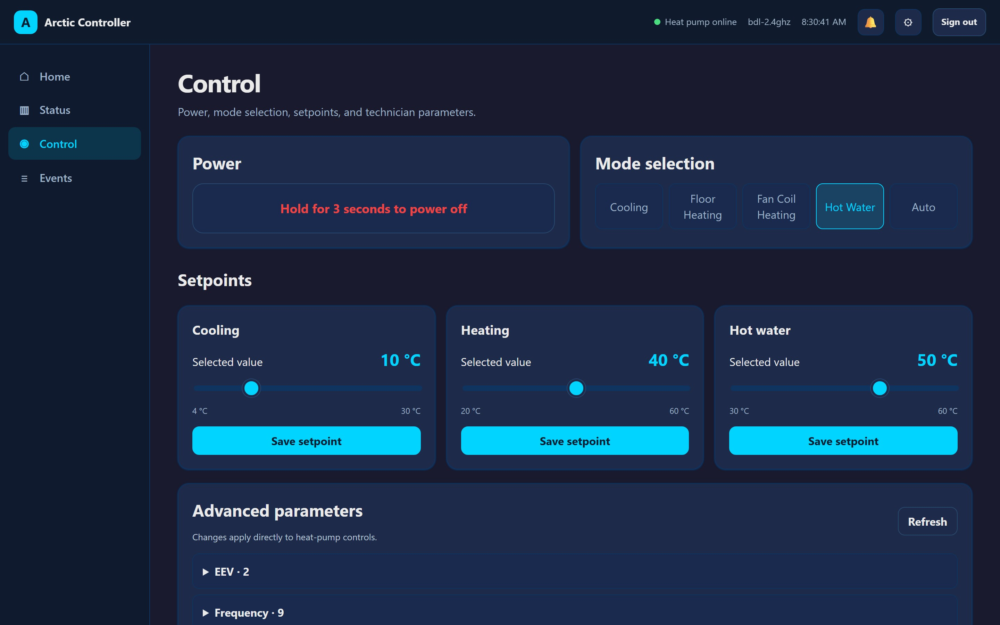

# Arctic Controller

[](https://github.com/sslivins/arctic-controller/actions/workflows/build.yml)
[](https://github.com/sslivins/arctic-controller/actions/workflows/device-tests.yml)

[](https://github.com/sslivins/arctic-controller/actions/workflows/device-tests.yml)
[](https://github.com/sslivins/arctic-controller/actions/workflows/device-tests.yml)
[](https://github.com/sslivins/arctic-controller/actions/workflows/device-tests.yml)

Replacement controller for Arctic air-to-water heat pumps. It runs on an
M5Stack Tab5, talks to the heat pump directly over RS-485, and gives you a touch
screen at the unit, a web dashboard, a Home Assistant integration, and a REST API.
Everything runs locally: no cloud account is needed, and the controller keeps working without internet access (only the weather display and GitHub update checks use it).

## Screenshots

### Touch screen

<p>
  
  
  
</p>

### Web dashboard

| Home | Cycle history |
|---|---|
|  |  |
| **Status** | **Control** |
|  |  |

## Features

- **Touch UI on the device** - Home dashboard (mode, tank temperature, COP, power, fan),
  full status readout, temperature detail, compressor cycle history graph, mode and
  setpoint control, event log, error codes with descriptions, and technician
  P-parameters. Shows the local weather in the status bar. English, French, or Spanish,
  with Celsius or Fahrenheit.
- **Web dashboard** - The same data and controls from any browser on your network, plus
  settings, firmware updates, diagnostics (live logs, downloadable report, device
  screenshot), and configuration of WiFi, time, location, and display.
- **Home Assistant** - Local-push integration ([`hass-macon`](https://github.com/sslivins/hass-macon)):
  state updates arrive over a secure WebSocket the moment they change, with no MQTT
  broker or cloud relay. Pair from the device screen with a one-time code.
- **REST API** - JSON API covering status, control, history, events, logs, and
  firmware, documented in [docs/openapi.yaml](docs/openapi.yaml).
- **OTA updates** - Install new releases straight from GitHub (the controller checks for
  them) or upload a `.bin`. Dual A/B partitions with automatic rollback if the new
  firmware fails to come up.
- **Security** - HTTPS only, login-protected web UI, per-device API key, and separate
  revocable credentials for Home Assistant.
- **Reliability** - Persistent event log and crash/brownout tracking, and a safe-restart
  path that finishes any in-flight heat-pump transaction and releases the RS-485 bus
  before every reboot.
- **Discovery** - Advertises itself over mDNS as `arctic-xxxx.local` (the last four hex
  digits of its WiFi MAC), so several controllers can share one network.
- **Demo mode** - Simulated heat-pump data for trying the UI without a unit attached.

## Hardware

- **Platform:** M5Stack Tab5 (ESP32-P4 main processor, ESP32-C6 WiFi co-processor)
- **Display:** 5" 720x1280 touch display, UI built with LVGL
- **RTC:** Battery-backed real-time clock
- **RS-485:** SIT3088 transceiver for Macon/Tuya communication with the heat pump

## Heat Pump Communication

The controller talks to the heat pump through the shared
[`arctic-macon`](https://github.com/sslivins/arctic-macon) library (a git submodule in
`components/arctic-macon`), using the unit's Tuya 55AA protocol at 4800 baud, 8E1.

### Monitored Data
- Selected working mode and actual operation (idle, heating, cooling, hot water, defrost)
- Equipment state: compressor, fan (speed and RPM), water pump, aux heater
- Temperatures: tank, water inlet/outlet, outdoor ambient, outdoor and indoor coil,
  compressor discharge and suction, IPM module
- Compressor frequency and electronic expansion valve position
- AC voltage and current, DC bus voltage, power draw, heat output, and COP
- Setpoints (cooling, heating, hot water) and their limits
- Active error codes with descriptions, plus an error history

### Control
- Working mode and the cooling and hot-water setpoints, from the device, web UI,
  REST API, or Home Assistant
- Technician P-parameters (read and write) from the device and web UI

Unit power and the heating setpoint have no verified write command on this unit yet,
so those controls refuse the change instead of guessing.

### RS-485 Pinout
| Signal | GPIO |
|--------|------|
| TX     | 20   |
| RX     | 21   |
| DIR    | 34   |

### RS-485 Bus Modes

The bus behaviour is selected at build time via a Kconfig `choice`
(`main/Kconfig.projbuild`, menu *Arctic Controller → Arctic RS485 bus mode*).

| Mode (`CONFIG_…`) | Behaviour |
|---|---|
| `ARCTIC_TUYA_MASTER` *(default, required for releases)* | **Active master.** The Tab5 is the *sole* bus master: it polls telemetry (fc=0x03) and writes setpoints (fc=0x06) via the `MaconLink` transaction layer. **The OEM controller must be physically disconnected**, because two masters collide. On boot the firmware listens for existing bus traffic and refuses to transmit if another master is detected. |
| `ARCTIC_TUYA_LISTEN` | **Passive listen (bench/validation only).** RX-only; DIR is held low so the Tab5 never transmits. Decodes the OEM controller's bus traffic, so it is safe to splice in alongside the real controller. |

## Web Interface

Open `https://arctic-xxxx.local` (or the controller's IP address) in a browser. The
controller only serves the UI and API over HTTPS; plain `http://` returns a notice
telling you to switch. It uses a self-signed certificate by default, so your browser
will ask you to accept it the first time. You can install your own certificate through
the API (`/api/tls/certificate`).

### Pages
- **Home** - Current operation, tank temperature, equipment, COP and power, errors,
  and the latest cycle
- **Status** - Every live reading from the heat pump
- **Cycle history** - Compressor run cycles with inlet, outlet, and setpoint
  temperatures over the last 8 hours
- **Control** - Working mode and setpoints
- **Events** - Equipment starts/stops, mode and setpoint changes, reboots, and errors
- **Settings** - WiFi, firmware, time and location, display, preferences (units,
  device language, demo mode), security, Home Assistant, diagnostics, and system
  (reboot, factory reset)

## Home Assistant

Install the [`hass-macon`](https://github.com/sslivins/hass-macon) custom integration,
which uses the [`pymacon`](https://github.com/sslivins/pymacon) client library. Then:

1. On the controller, open **Settings → Home Assistant** and tap **Start Pairing**.
2. Add the integration in Home Assistant and enter the one-time code shown on the
   device. Controllers are discovered automatically over mDNS.

Home Assistant gets its own credentials, separate from your web login and API key, and
connects on a dedicated HTTPS/WebSocket port (8443). State is pushed the moment it
changes, with periodic REST reconciliation as a fallback. Controls are limited to an
allowlist (working mode and setpoints); Home Assistant never gets register-level or
technician access. Re-pairing or revoking from the device cuts off the old credentials.

The design and threat model are in
[docs/home-assistant-integration.md](docs/home-assistant-integration.md).

## Security

- **Set your own password first.** The factory web login is `arctic` / `arctic`, but the
  controller makes you replace it before the UI or API can be used. To prove you have
  physical access, open **Settings → Security** on the device and enter the one-time
  code it shows. The same code flow handles a forgotten password.
- **API key** - A per-device key for scripts and other tools, sent as an `X-API-Key`
  header. View or regenerate it in the web UI under Settings → Security.
- **Home Assistant credentials** - Issued at pairing and revocable from the device.

## REST API

Full documentation is in [docs/openapi.yaml](docs/openapi.yaml). Every endpoint except
a few bootstrap routes (`/api/health`, `/api/auth/status`) needs either the API key or
a logged-in web session.

| Area | Endpoints |
|------|-----------|
| System | `/api/status`, `/api/info`, `/api/time`, `/api/time/config`, `/api/time/sync`, `/api/location`, `/api/weather`, `/api/preferences`, `/api/display/brightness` |
| Heat pump | `/api/heatpump/status`, `/api/heatpump/setpoints`, `/api/heatpump/mode`, `/api/heatpump/errors`, `/api/heatpump/errors/history`, `/api/heatpump/advanced`, `/api/heatpump/windows`, `/api/heatpump/temperature-history`, `/api/heatpump/demo` |
| History and diagnostics | `/api/events`, `/api/logs`, `/api/logs/persisted`, `/api/notifications`, `/api/heatpump/diagnostic`, `/api/screenshot` |
| Firmware | `/api/ota/status`, `/api/ota/releases`, `/api/ota/github`, `/api/ota/upload`, `/api/ota/reboot` |
| WiFi | `/api/wifi`, `/api/wifi/scan`, `/api/wifi/networks`, `/api/wifi/connect`, `/api/wifi/disconnect` |
| Security | `/api/auth/config`, `/api/auth/credentials`, `/api/auth/apikey`, `/api/auth/apikey/regenerate`, `/api/tls/status`, `/api/tls/certificate` |
| Home Assistant | `/api/ha/status`, `/api/ha/pair`, `/api/ha/revoke`, and the integration's own versioned `/api/v1/*` contract on port 8443 |

### Examples
```bash
KEY=your-api-key
HOST=https://arctic-xxxx.local

# Heat pump status
curl -k -H "X-API-Key: $KEY" $HOST/api/heatpump/status

# Set the hot-water setpoint to 50 °C
curl -k -X PUT -H "X-API-Key: $KEY" -H "Content-Type: application/json" \
     -d '{"hot_water":50}' $HOST/api/heatpump/setpoints

# Grab a screenshot of the device display
curl -k -H "X-API-Key: $KEY" -o screen.jpg "$HOST/api/screenshot?format=jpeg"
```

`-k` skips certificate verification for the default self-signed certificate.

## OTA Updates

The controller checks GitHub for new releases and shows a notification when one is
available.

- **Web UI:** Settings → Firmware, then install the latest release or upload a `.bin`.
- **API:**
  ```bash
  # Install the latest GitHub release
  curl -k -H "X-API-Key: $KEY" $HOST/api/ota/releases       # check
  curl -k -X POST -H "X-API-Key: $KEY" $HOST/api/ota/github  # install

  # Or upload a local build
  curl -k -X POST -H "X-API-Key: $KEY" -H "Content-Type: application/octet-stream" \
       --data-binary @build/arctic_controller.bin $HOST/api/ota/upload
  ```

**Safety:**
- Dual A/B partitions. New firmware must come up with a working UI and network before
  it is marked good; otherwise the bootloader rolls back to the previous version.
- The image is validated before the controller reboots into it.
- Before every reboot the controller finishes any in-flight heat-pump transaction,
  blocks further bus writes, and releases the RS-485 line, so an update never
  interrupts a command to the heat pump.
- The first install on a new board must be a full USB flash (see Getting Started); OTA
  works from then on.

## Testing

### Host Tests
Pure C++ unit tests for firmware logic, built and run on the host (no device needed).

```bash
cmake -S main/tests -B build-host && cmake --build build-host && ctest --test-dir build-host
```

### Device Tests (LVGL UI)
Tests that drive the device's touch UI through the test API (requires a firmware build
with `CONFIG_TEST_ENDPOINTS=y`). See [tests/device/README.md](tests/device/README.md).

```bash
ARCTIC_URL=https://arctic-xxxx.local pytest tests/device/ -v
```

### Web Dashboard Tests (Playwright)
Browser-based tests for the web dashboard. See [tests/web/README.md](tests/web/README.md).

```bash
pip install -r tests/web/requirements.txt
playwright install chromium
ARCTIC_URL=https://arctic-xxxx.local pytest tests/web/ -v
```

### API Contract Tests (Schemathesis)
Fuzz testing of the REST API against the OpenAPI spec. See [tests/api/](tests/api/).

```bash
ARCTIC_URL=https://arctic-xxxx.local pytest tests/api/ -v
```

### RS-485 End-to-End Tests (arctic-simulator)
Makes the controller the live RS-485 master against an
[arctic-simulator](https://github.com/sslivins/arctic-simulator) bench and checks that
every field, fault and verified write round-trips. The fields and fault codes come from
the simulator's arctic-macon catalog (`/api/fields`, `/api/faults/catalog`), so the
suite has no register map of its own. It refuses to run if the controller and simulator
report different arctic-macon fingerprints. It takes the controller out of demo mode,
leases the simulator for the run, and puts both back afterwards.

```bash
ARCTIC_URL=https://arctic-xxxx.local ARCTIC_API_KEY=... ARCTIC_SIM_URL=http://192.168.1.177 \
  pytest tests/rs485/ -v
```

## Project Structure

```
├── main/                     # Firmware source
│   ├── main.cpp              # Entry point
│   ├── *_screen.cpp          # Touch UI screens (home, status, history, events, ...)
│   ├── settings/             # Settings screens
│   ├── heatpump_controller.* # Heat pump state and control
│   ├── tuya/                 # RS-485 bus master and UART transport
│   ├── api_server.*          # Web UI, REST API, and mDNS
│   ├── ha_integration.*      # Home Assistant pairing, state, and WebSocket push
│   ├── auth_manager.*        # Passwords, sessions, and API keys
│   ├── ota_manager.*         # OTA updates and GitHub release checks
│   ├── event_log.*           # Persistent event log
│   ├── i18n/                 # Device UI translations (EN/FR/ES)
│   ├── fonts/                # Montserrat fonts with Latin-1 and extra glyphs
│   ├── web/index.html        # Web interface (embedded in firmware)
│   └── tests/                # Host unit tests
├── components/
│   └── arctic-macon/         # Shared heat pump protocol library (git submodule)
├── dependencies/             # LVGL and UI libraries (fetched via fetch_repos.py)
├── tests/                    # Device, web, API, and RS-485 test suites
├── docs/                     # OpenAPI spec, Home Assistant design, CI notes
├── partitions.csv            # Partition table (A/B OTA)
└── sdkconfig                 # ESP-IDF settings
```

## Getting Started

### Prerequisites
- [ESP-IDF v6.1](https://docs.espressif.com/projects/esp-idf/en/latest/esp32p4/get-started/)
- Python 3.x

### 1. Clone and fetch dependencies

```bash
git clone --recursive https://github.com/sslivins/arctic-controller.git
cd arctic-controller
python fetch_repos.py
```

(If you already cloned without `--recursive`, run `git submodule update --init --recursive`.)

### 2. Build

```bash
idf.py build
```

### 3. Flash over USB

The first install on a board must be a full USB flash so it gets the right partition
layout. After that, use OTA.

```bash
idf.py -p [PORT] flash monitor
```

Or flash a release without building, using the files attached to the
[GitHub release](https://github.com/sslivins/arctic-controller/releases/latest):

```bash
esptool.py --chip esp32p4 write_flash \
  0x2000 bootloader.bin \
  0x8000 partition-table.bin \
  0x49000 ota_data_initial.bin \
  0x50000 arctic_controller.bin
```

### 4. Connect to WiFi

Pick your network on the device under **Settings → WiFi**, then open
`https://arctic-xxxx.local` and set your password (see [Security](#security)).

## Configuration

- **Build options:** `idf.py menuconfig` (the *Arctic Controller* menu holds the RS-485
  bus mode and other project settings)
- **LVGL settings:** `lv_conf.h`
- **ESP-IDF settings:** `sdkconfig`
